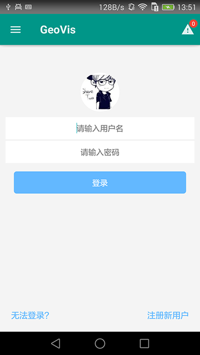
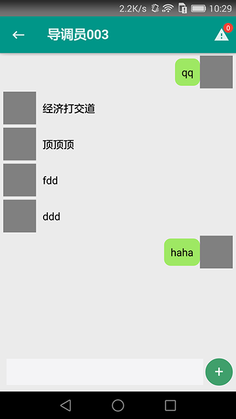
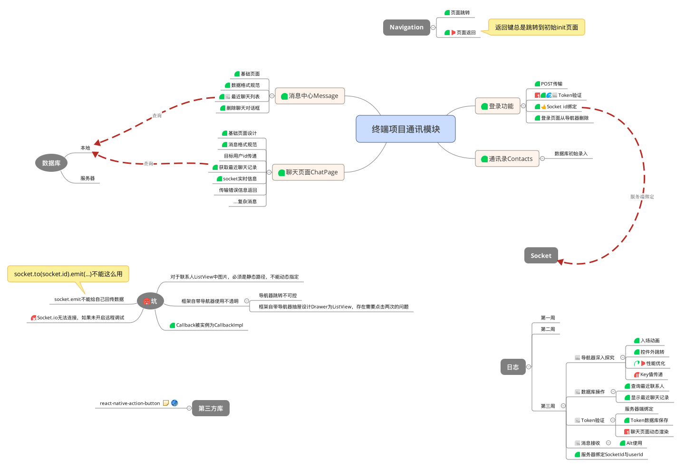

# Chat
一个模仿微信实现实时通讯的React-Native项目，使用WebSocket实现数据传输，使用React-Native-Material-Design模板。

## TODO:
* 登录功能完善：在登录前不能访问其他页面
* 由于项目特性，未添加客户端用户注册功能，已写好界面。
* ChatPage页面ActionButton完善(存在bug，如果运行报错，可先删除。)
* 当对方不在ChatPage页面时，建立消息队列。
* Bug：不开启Debug JS Remotly，无法建立Socket连接。
* 在未登录情况下，访问联系人页面有warning。
* 用户头像显示
* 联系人页面中隐藏自身对话框

## DONE
1. 用户登录验证
2. Socket与用户id绑定
3. 通讯录数据库查询
4. 服务器消息转发

## Installation
### Client
1. npm install
2. React-Native-Splashscreen[GitHub](https://github.com/remobile/react-native-splashscreen)
3. React-Native-Sqlite-Storage[GitHub](https://github.com/andpor/react-native-sqlite-storage)
4. React-Natiev-ActionButton(存在bug，如果运行报错，可在``/src/scenes/chatpage``删除相关组件。)[GitHub](https://github.com/mastermoo/react-native-action-button)

### Server
1. 安装mongo数据库，创建``/data/db``文件夹
2. 运行``./bin/www``开启服务器
3. 在``http://localhost:3000/register``注册用户，用户信息需参考客户端代码``/src/utils/sqlite.js->createUsersTable()``中信息。 
4. 注意更改Client中``index.android.js``中socket地址

## Tips & Tricks
### Database
客户端数据库使用SQLite，服务器端使用Mongo。
* [react-native-sqlite-storage](https://github.com/andpor/react-native-sqlite-storage)
* [Cordova-sqlite-storage](https://github.com/jbrodriguez/react-native-android-sqlite)

### Alt
Socket.io在程序运行时建立，监听private message事件。由于不确定此时用户处于什么界面，所以使用alt保存消息状态，再做处理。[GitHub](https://github.com/goatslacker/alt)

### React-Native-Socket.io
使用原生socket.io-client [stackoverflow](http://stackoverflow.com/questions/29408492/is-it-possible-to-combine-react-native-with-socket-io)  
**BUG** : 需开启Debug JS Remotly后才能建立服务器连接。

## Reference
1. [awesome-react-native](https://github.com/jondot/awesome-react-native)

## Xmind

